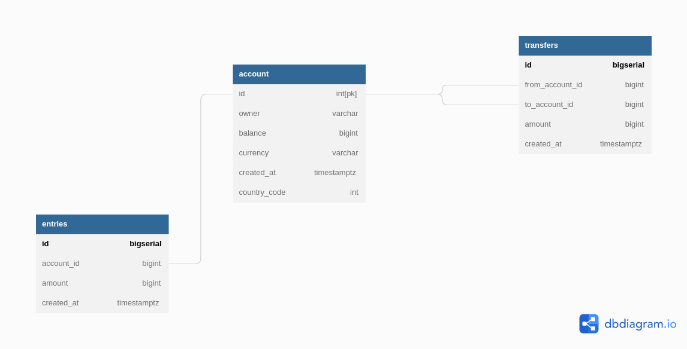

# A simple bank Application backend with Golang
## Topic covered
- Create and manage account
  - owner, balance, currency
- Money transfer transaction
  - create an account entry for each change
- Money transfer transaction
    - perform money transfer between 2 accounts 
    - consistent transactions

## Database Design


## migrate commands
```
migrate create -ext sql -dir db/migration -seq add_sessions
```

## Viper
  - find, load, unmarshal config file (json, yaml, toml, env, ini)
  - read config from env variables
  - read config from remote system etcd, consul
  - live watcher for changing config files
## mock database for test
  - isolates test data to avoid conflicts
  - faster to test
  - can achieve 100% test coverage